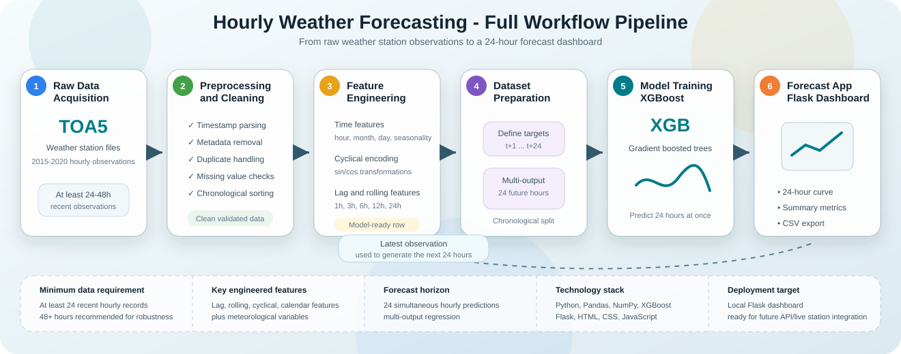

# 24-Hour Weather Forecasting System

An end-to-end AI forecasting system that turns raw weather station observations into full 24-hour air temperature forecasts through preprocessing, feature engineering, model training, and an interactive Flask dashboard.



## Project Story

This project started from a simple observation: local weather forecasts are often imperfect.

After arriving in Sofia, I began noticing small but persistent differences between forecast apps and the real sky. Some days predicted fog never appeared. Other times, light rain arrived even though no precipitation had been forecasted. That curiosity led to a bigger question:

> Why is local weather forecasting still so difficult?

The answer quickly became clear: weather forecasting is not only about choosing a powerful model. It is about building a complete system around messy real-world data.

This project grew into an end-to-end hourly forecasting pipeline built from real weather station observations collected between **2015 and 2020**. The final system can generate a complete **24-hour temperature forecast** from recent weather station data and display the results in a web dashboard.

The full write-up is available on Medium:

[From Raw Weather Station Data to 24-Hour Forecasts: Building an End-to-End AI Forecasting System](https://medium.com/@yahya.menkari/from-raw-weather-station-data-to-24-hour-forecasts-building-an-end-to-end-ai-forecasting-system-c73472605fa1)

## What This Repository Contains

This repository contains the application and deployment layer of the forecasting system:

- a Flask web application
- raw weather station preprocessing logic
- feature engineering code
- trained multi-output XGBoost model artifacts
- sample input and output files
- a polished dashboard for forecast visualization

The notebook experimentation and broader modeling journey are described in the Medium article. This repo focuses on the final usable forecasting application.

## Problem Context

Weather station data is realistic, but it is rarely clean.

The original dataset contained more than **43,000 hourly observations** and included meteorological variables such as:

- air temperature
- relative humidity
- barometric pressure
- rainfall
- solar radiation
- wind speed and direction
- dew point and wet bulb temperature
- heat index
- soil temperature and soil electrical conductivity

Because the data came from operational station recordings, it also contained real-world complications:

- metadata rows
- duplicated timestamps
- missing observations
- formatting inconsistencies
- sensor-related anomalies
- temporal gaps that could break forecasting features

Handling these issues became one of the most important parts of the project.

## End-to-End Workflow

The final system follows this pipeline:

```text
Raw weather station files
        |
        v
Preprocessing and validation
        |
        v
Temporal feature engineering
        |
        v
Lag and rolling statistics
        |
        v
Multi-output XGBoost model
        |
        v
24-hour temperature forecast
        |
        v
Interactive Flask dashboard
```

The app supports both:

- **engineered model-ready inputs**
- **raw recent station files that require automatic preprocessing**

This second mode was important because it moves the project closer to a realistic operational forecasting system, where incoming station observations must be cleaned and transformed before inference.

## Feature Engineering

One of the biggest lessons from the project was that model performance depended heavily on feature quality.

The pipeline creates several groups of forecasting features.

### Calendar and Time Features

- hour
- month
- day of week
- day of year
- weekend indicator

### Cyclical Time Encoding

Weather patterns are cyclical. Midnight and 11 PM are close in time, but their raw numeric values are far apart. To preserve cyclical continuity, the pipeline uses sine and cosine encodings for time-based variables.

Examples:

- `hour_sin`, `hour_cos`
- `month_sin`, `month_cos`
- `dayofyear_sin`, `dayofyear_cos`

### Lag Features

Previous temperature values provide short-term memory to the model:

- `Air_Temperature_lag1`
- `Air_Temperature_lag3`
- `Air_Temperature_lag6`
- `Air_Temperature_lag12`
- `Air_Temperature_lag24`

### Rolling Window Features

Rolling statistics help capture short-term trends and local variability:

- rolling means over 3, 6, 12, and 24 hours
- rolling standard deviations over 3, 6, 12, and 24 hours

The exact feature schema used by the trained model is stored in:

```text
models/feature_columns.json
```

## Model Experiments

The project explored both classical machine learning and deep learning approaches.

Tested model families included:

- XGBoost
- GRU networks
- CNN-LSTM architectures
- CNN-GRU hybrids
- Temporal Convolutional Networks (TCN)

At first, deep learning models seemed like the natural choice for weather forecasting because they are designed to process sequences. However, the experimental results showed something more nuanced.

The tuned XGBoost model performed extremely well because the feature engineering pipeline already provided a rich representation of temporal behavior. Lag features, rolling statistics, calendar variables, and cyclical encodings allowed XGBoost to exploit weather patterns efficiently without needing to learn everything directly from raw sequences.

One of the main lessons:

> Strong feature engineering can outperform increased model complexity, especially on structured time-series data.

## Multi-Step Forecasting

The final model is designed for **multi-step forecasting**.

Instead of predicting only one future value, it predicts the full next-day sequence:

```text
t+1, t+2, t+3, ..., t+24
```

This means one model inference produces a complete 24-hour forecast vector.

The trained model artifact is stored in:

```text
models/multioutput_xgb.pkl
```

Model metadata is stored in:

```text
models/metadata.json
```

## Web Application

The final stage of the project was turning the trained forecasting pipeline into a usable application.

The Flask application can:

1. receive an uploaded weather file
2. detect whether it is raw or already engineered
3. preprocess raw station data when needed
4. generate the latest model-ready input row
5. load the trained XGBoost model
6. predict the next 24 hourly temperatures
7. return the forecast to the frontend
8. visualize the result in an interactive dashboard

The dashboard includes:

- 24-hour forecast curve
- minimum, maximum, and average predicted temperature
- warmest and coolest forecast hour
- trend insight
- hourly rhythm strip
- detailed forecast table
- CSV export

## Repository Structure

```text
app.py                  Flask application entry point
requirements.txt        Python dependencies
README.md               Project documentation
.gitignore              Git ignore rules

docs/
  workflow-pipeline.svg Workflow illustration used in this README

models/
  feature_columns.json  Required model input columns
  metadata.json         Model metadata
  multioutput_xgb.pkl   Trained multi-output XGBoost model
  sample_input.csv      Sample engineered input
  sample_output.csv     Sample forecast output
  sample_data.xlsx      Sample raw-style data

src/
  predict.py            Model loading and prediction logic
  raw_preprocess.py     Raw station parsing and feature engineering
  utils.py              Forecast formatting and summary utilities

templates/
  index.html            Flask dashboard template

static/
  css/style.css         Dashboard styling
  js/app.js             Frontend interactions and chart rendering
  assets/               UI image assets
```

## Setup

Create a virtual environment:

```bash
python -m venv venv
```

Activate it.

On Windows:

```bash
venv\Scripts\activate
```

Install dependencies:

```bash
pip install -r requirements.txt
```

Run the application:

```bash
python app.py
```

Open the dashboard:

```text
http://127.0.0.1:5001/
```

## Usage

### Engineered Input Mode

Use this mode when the uploaded file already contains all required model features.

Sample file:

```text
models/sample_input.csv
```

### Raw Station Data Mode

Use this mode when uploading recent hourly weather station data.

The app will:

1. detect and parse the real header row
2. validate required raw weather columns
3. convert measurements to numeric values
4. sort observations chronologically
5. generate time, lag, and rolling features
6. extract the latest valid model input row
7. produce the 24-hour forecast

For robust raw-mode predictions, recent continuous hourly records are required. At least 24 hours are needed for lag and rolling features, while 48+ hours are recommended for more reliable preprocessing.

## Forecast Output

The app formats forecasts as:

```text
hour_ahead, forecast_time, predicted_temperature
```

The forecast can also be downloaded as a CSV file directly from the dashboard.

## Key Lessons

This project reinforced several important lessons:

- Real-world machine learning projects are often dominated by data engineering.
- Time-series forecasting depends heavily on temporal consistency.
- Carefully engineered features can outperform more complex architectures.
- Deployment introduces challenges that do not appear in notebooks.
- A useful AI system requires data quality, modeling, software engineering, and interface design to work together.

## Future Improvements

Possible next steps include:

- live weather station API integration
- automated real-time forecast scheduling
- extended forecast horizons
- richer uncertainty estimation
- hybrid deep learning and gradient boosting approaches
- cloud deployment

## Author

Built by **Yahya Menkari** as part of a final-year AI and weather forecasting project.

Full project write-up:

[From Raw Weather Station Data to 24-Hour Forecasts: Building an End-to-End AI Forecasting System](https://medium.com/@yahya.menkari/from-raw-weather-station-data-to-24-hour-forecasts-building-an-end-to-end-ai-forecasting-system-c73472605fa1)
